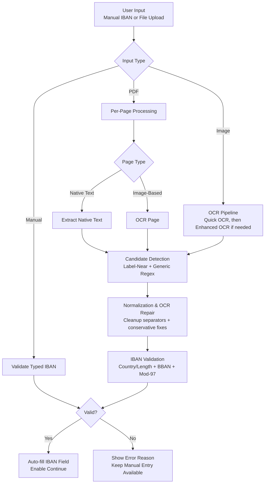

# 🏦 IBAN Extractor

Multilingual IBAN extractor from images and PDFs (native or scanned). Detects, extracts, and validates IBANs with full ISO 13616 checksum verification across 109 IBAN-eligible countries.

## Features

- **Dual input support**: images (PNG, JPG, TIFF, BMP, WEBP) and PDFs
- **Smart PDF handling**: auto-detects native text vs scanned pages per page
- **Multilingual OCR**: Tesseract with configurable language packs (default: English + French)
- **Full IBAN validation**:
  - Country code recognition (109 countries)
  - Per-country length verification
  - BBAN format validation
  - ISO 13616 mod-97 checksum
- **Image preprocessing**: deskewing, denoising, binarization, upscaling for better OCR accuracy
- **Single-best extraction**: returns one best IBAN for deterministic and fast output
- **User-friendly messages**: clear feedback when no IBAN is found or when verification is needed

## Project Structure

```
IBAN-Extractor/
├── app_streamlit.py        # Streamlit web interface
├── iban_extractor.py       # Core extraction pipeline
├── iban_validator.py       # IBAN validation (country registry + mod-97)
├── ocr_engine.py           # OCR handling (EasyOCR / Tesseract)
├── pdf_handler.py          # PDF processing (native + image-based)
├── image_preprocessor.py   # Image preprocessing for OCR quality
├── requirements.txt
└── README.md
```

## Setup

```bash
pip install -r requirements.txt
```

For Tesseract (required):
- **Windows**: download from https://github.com/UB-Mannheim/tesseract/wiki
- **macOS**: `brew install tesseract`
- **Linux**: `sudo apt install tesseract-ocr`

## Usage

### Streamlit App

Live app: https://isi19-iban-extractor-app-streamlit-kleyqu.streamlit.app/

```bash
streamlit run app_streamlit.py
```

### Python API

```python
from PIL import Image
from iban_extractor import extract_from_image, extract_from_pdf

# From image (returns at most one best IBAN)
image = Image.open("iban.png")
result = extract_from_image(image)
if result.ibans:
    iban = result.ibans[0]
    print(f"{iban.formatted} — {'Valid' if iban.valid else 'Invalid'} ({iban.country_name})")

# From PDF (fast path: stops when first valid IBAN is found)
with open("document.pdf", "rb") as f:
    result = extract_from_pdf(f.read())
    if result.ibans:
        iban = result.ibans[0]
        print(f"{iban.formatted} — Page {iban.source_page}")
```

## Processing Pipeline Review



### Next Step (Planned)

- Add a camera scan option with live OCR so users can capture a document directly and auto-fill the IBAN field in real time.

## Validation Details

Every extracted IBAN goes through 3 validation layers:

| Check | What it catches |
|---|---|
| Country code + length | Unknown country, truncated/padded IBANs |
| BBAN format | Wrong character types (letters vs digits) |
| Mod-97 checksum | Typos, transpositions, OCR misreads |

## Supported Countries

The validator currently covers 109 IBAN-eligible country codes from the embedded registry.
